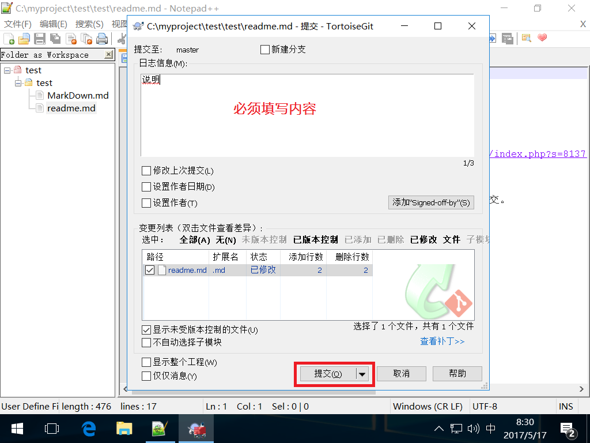
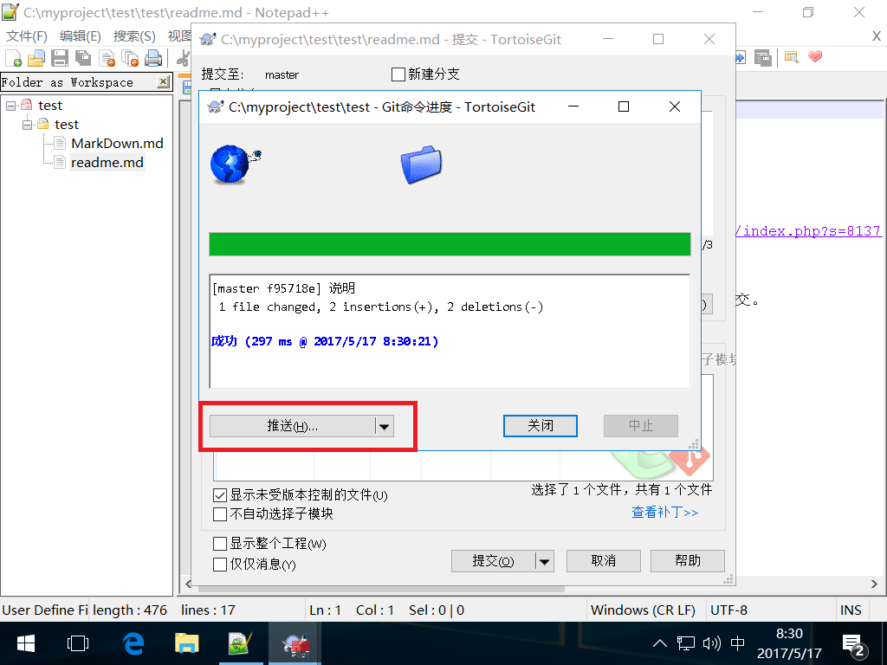
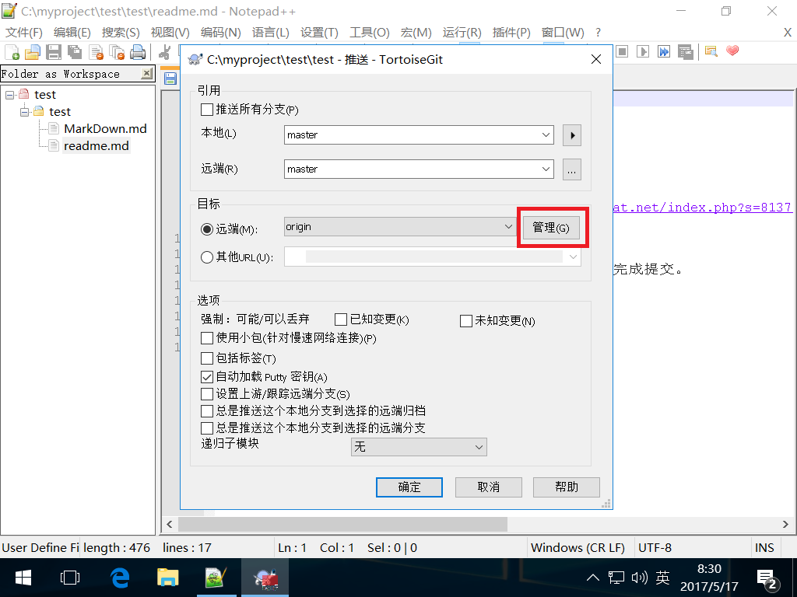
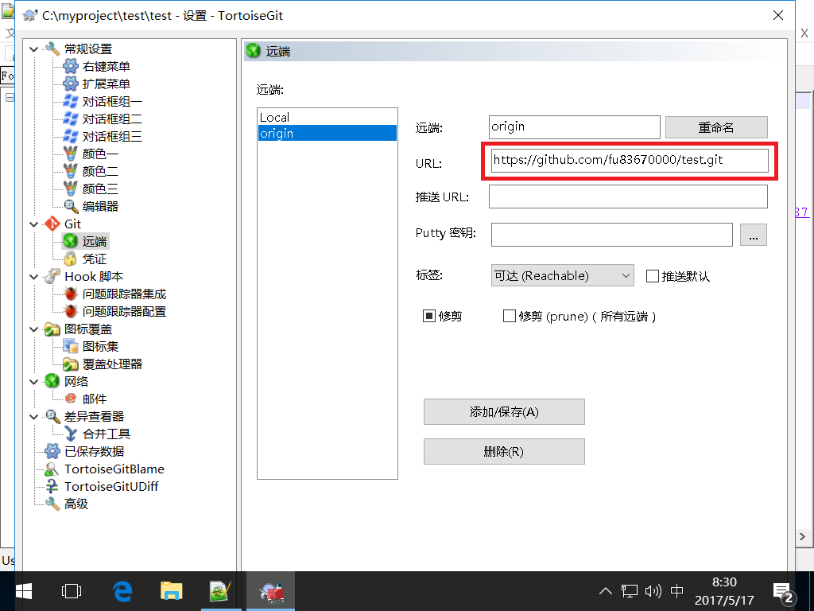

# 使用 NotePad++ 向 GitHub 提交文档方法

**注意：NotePad++ 安装的是 32bit 版**
## 安装相关软件

- Git for Windows  （Git-2.12/2/2-64-bit）
- TortoiseGit（2.4.0.2-64bit）及中文语言包
- NotePad ++ 的 Git插件 [NPPGit](https://forum.lowyat.net/index.php?s=813777532e8da2a3789f63ae43c8fbc2&act=Attach&type=post&id=1486188)

## 配置

在简单方式下，通过页面认证完成提交。

## 提交过程
文档保存后，在NotePad++菜单**插件**中选取 **Git**子菜单中的相应功能项完成。例如：

| Step 1 | Step 2 |
|:----:|:------:|
|  |  |
| Step 3 | Step 4 |
|  |  |

